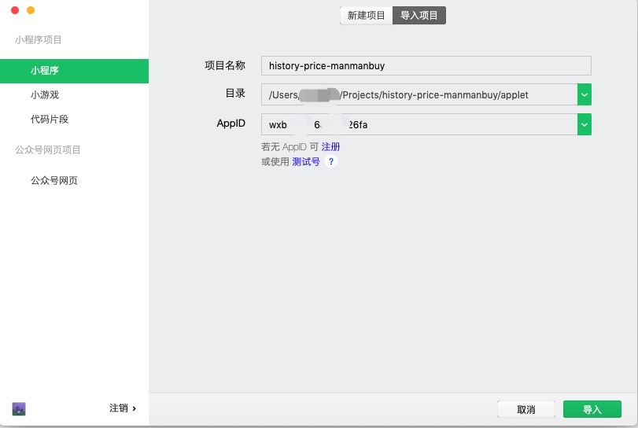

# 商品历史价格查询

使用Python与微信小程序构建  
开发工具：PyCharm与微信小程序开发者工具  
数据部分由[慢慢买](http://manmanbuy.com/)采集整理并提供  

## 目录结构

``` md
.
├── applet      原生微信小程序根目录
└── spider      爬虫根目录
```

## 说明

### 爬虫部分

爬虫部分使用`requests`库作为请求库，因为获取到的数据是`json`字符串，因此可以直接序列化与反序列化。获取到的数据中日期的格式为`/Date(1575820800000+0800)/`，这并不是我们想要的，因此使用正则表达式对字符串进行必要的提取。  

爬取过程中受到了反爬，具体是因为[mmm](http://manmanbuy.com/)使用了一种类似于`c/s`方式的可信客户端请求。在请求时，需要使用商品链接通过`js`脚本生成`token`，再使用**商品链接**和**token**一起请求接口。这个部分的实现方式是使用`PyExecJS`库的`execjs`模块执行**mmm**官方生成`token`的`js`脚本。  

本项目使用`flask`提供爬虫数据接口，实现表单提交。  

### 微信小程序

本项目是原生微信小程序，为了方便开发者体验，一切依赖都已剔除。  

因为涉及到大量数据的显示，因对比过其他几个微信小程序图表框架，本项目使用[echarts-for-weixin](https://github.com/ecomfe/echarts-for-weixin)作为图表框架，其表现相对较出色。

## 如何使用

### 爬虫

> 请先保证使用的是`Python3`和`pip3`  
> 以下操作都是在`spider`爬虫根目录下进行  

#### 1、安装Python依赖

``` bash
pip3 install -r requirements.txt
```

#### 2、安装nodejs

爬虫请求接口时调用`JS脚本`生成`token`，因此需要为`JS脚本`安装执行的环境，如果已装有`nodejs`，请忽略  
如何安装请参考[nodejs](https://nodejs.org/zh-cn/)官方文档  

#### 3、单元测试

如果你只是想了解爬取的过程和爬到的数据，请执行`python mmm.py`，否则请忽略

#### 4、开启flask

``` bash
python api.py
```

默认开启在 `http://0.0.0.0:9500/`，如果需要`Debug`或其他功能，请自行修改`api.py`

#### 5、测试数据接口

``` bash
curl --header "Content-Type: application/json" \
  --request POST \
  --data '{"url":"替换成你想要查询的商品链接"}' \
  http://localhost:9500/
```

### 小程序

#### 1、导入项目

使用[微信开发者工具](https://developers.weixin.qq.com/miniprogram/dev/devtools/devtools.html)导入`applet`文件夹



#### 2、编译运行

...

#### 3、使用预览而不是真机调试

因为微信小程序真机环境中不能执行动态脚本，因此会造成`canvas`的加载问题，请使用预览以在手机端使用

## 写到最后

项目仅供学习参考，如有侵犯隐私，告知我将立即删除项目
